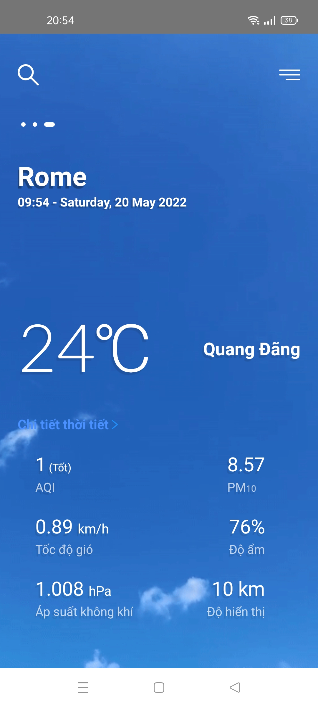
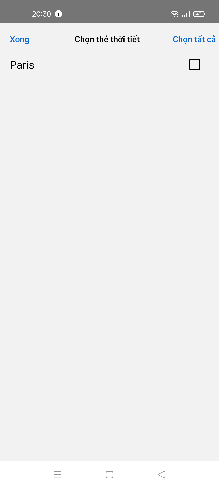
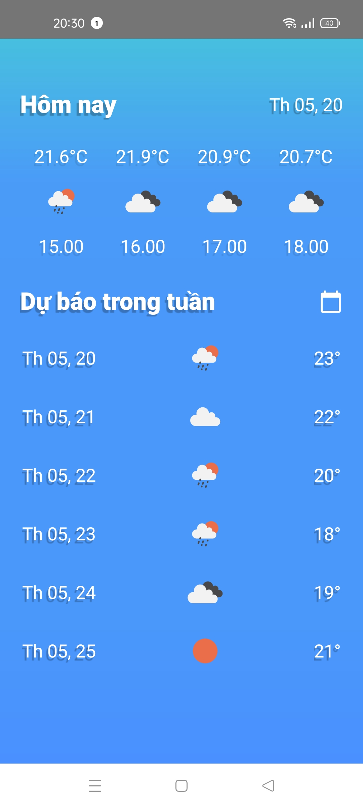
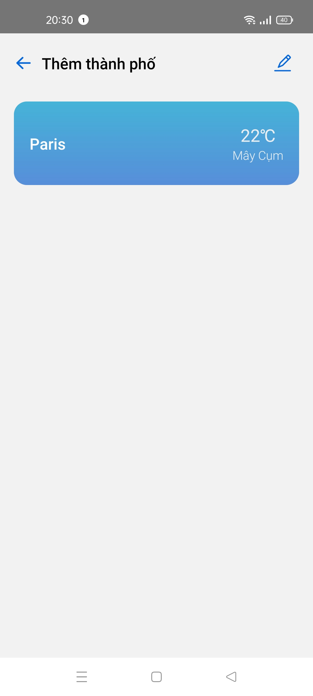

# React Native Weather
  A weather app can show weather forecast information weather such as temperature, humidity, wind speed hourly in a day and the following days (use the APIs provided by weather forecast services on the Internet)
## Demo
## Screenshots
### Home

### AddCity Screen

### EditCity Screen

### Details information

### ListCity

